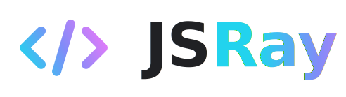

<p align="center">
  <picture>
    <source media="(prefers-color-scheme: dark)" srcset="assets/brand/jsray-logo-hero-dark.svg">
    
  </picture>
</p>

**English** · [简体中文](README.zh-CN.md)

[](LICENSE)
[](CHANGELOG.md)
[](docs/versioning.md)
[](package.json)
[](dist/)
[](docs/languages.md)

> JavaScript-native code rendering kernel · zero dependencies · 23-class token semantics

<sub>Public beta · Core renderer only · Platform plugins are separate repositories</sub>

---

## Features

JSRay visually separates **six identifier families** so you can tell parameters, constants, builtins, function declarations and calls apart at a glance:

| Category | Dark | Light | Intuition |
|---|---|---|---|
| Plain variable | `#E1E4E8` | `#1C1C1E` | Neutral |
| **Parameter** | `#F2B870` italic | `#B25E00` italic | Warm amber · "input flowing in" |
| **System variable** (`this/self/console`) | `#7AB1FF` bold | `#0F68A0` bold | Cool blue · "runtime" |
| **Constant** (`MAX_*`) | `#E2C792` | `#88611E` | Muted gold · "frozen" |
| **Function declaration** | `#5DD8B0` bold | `#0F8568` bold | Bright mint · "I define" |
| **Function call** | `#4FBD92` | `#1F7F66` | Mid mint · "I invoke" |
| **Builtin function** (`fetch/print`) | `#C9A6F2` | `#7A40C2` | Lavender · "standard library" |
| **Type** (`User/str`) | `#5AC8FA` | `#0070C9` | Sharp cyan |
| **Property** (`.name`) | `#FFB1B1` | `#B23D6B` | Warm rose · "belongs to" |

---

## Project Boundary

This repository is **JSRay Core**, the standalone JavaScript-native code rendering kernel. Platform plugins are separate projects and should live in separate git repositories.

See [docs/projects.md](docs/projects.md) for the project split and release boundaries.

## Ecosystem Vision

JSRay is intended to be a fully open-source code rendering ecosystem: one small Core renderer, many official and community integrations.

> One renderer. Many places for code to shine.

Official integrations live in their own repositories, use JSRay Core by default, and stay fully usable without paid feature locks. Planned integrations:

| Integration | Repository | Status |
|---|---|---|
| WordPress plugin | `jsray-wp` | Coming soon |
| VS Code extension | `jsray-vscode` | Coming soon |
| Terminal CLI | `jsray-terminal` | Coming soon |
| …and more | — | Community & official adapters welcome |

Each repository is published as it reaches its own beta. Every integration exposes renderer adapter hooks, so a host project can swap in another renderer when it needs to.

---

## Quick Start

```html
<!-- 1. Pick a theme (palette).  More themes coming; "default" is the signature look. -->
<link rel="stylesheet" href="dist/themes/default.css">
<!-- 2. Load the core stylesheet (structure + token bindings). -->
<link rel="stylesheet" href="dist/jsray.css">

<body data-theme="dark">
  <pre><code class="language-js">
    function fibonacci(n) { return n; }
  </code></pre>
</body>
<script src="dist/jsray.js"></script>
```

Once loaded, JSRay **auto-scans** every `<code class="language-xxx">` element and colors it.
Switch dark/light by setting `<body data-theme="light">` or `"dark"`.
When no language class is present, `JSRay.detectLanguage()` can infer common snippets — shebang lines resolve the interpreter directly, and signal scoring covers PHP, Go, Swift, Kotlin, Dart, Lua, SQL, YAML, HTML, CSS, JavaScript, Python, shell, Elixir, Scala, Objective-C, R, Perl, PowerShell, Haskell, GraphQL, TOML, Dockerfile, Makefile, diff, and more.

### Themes

JSRay ships color palettes as separate stylesheets under `dist/themes/`. Always load **one theme** plus `jsray.css`. Available themes:

| Theme | File | Notes |
|---|---|---|
| **default** | `dist/themes/default.css` | The signature palette · dark + light variants |
| **aurora** | `dist/themes/aurora.css` | Polar night · glacial blue surfaces, aurora mint + violet accents · dark + light |
| **ember** | `dist/themes/ember.css` | Warm forge · charcoal surfaces, flame keywords, patina-mint functions · dark + light |
| **fjord** | `dist/themes/fjord.css` | Nordic low-chroma · calm blue-gray, made for long reading sessions · dark + light |

Every theme ships both dark and light variants (switch via `data-theme`) and covers all 23 token classes, so all supported languages render fully in any theme. Palette sources live in `themes/*.json`; `tools/generate-theme.mjs` fans them out to CSS. To switch themes, swap only the theme `<link>` — `jsray.css` stays the same.

### Programmatic API

```js
// Highlight a code string
const html = JSRay.highlight('const x = 42;', 'js');

// Highlight a single element
JSRay.highlightElement(document.querySelector('code'));

// Rescan the whole page
JSRay.highlightAll();

// Guess a language when a code block has no class
const lang = JSRay.detectLanguage('SELECT * FROM posts;');
```

---

## Supported Languages

| Language | Class identifier |
|---|---|
| JavaScript / TypeScript / JSX / TSX | `language-js` `language-ts` `language-jsx` `language-tsx` |
| Python | `language-python` `language-py` |
| PHP | `language-php` |
| Go | `language-go` |
| Swift / Kotlin / Dart / Lua | `language-swift` `language-kotlin` `language-kt` `language-dart` `language-lua` |
| Java | `language-java` |
| C / C++ / C# | `language-c` `language-cpp` `language-csharp` `language-cs` |
| Ruby | `language-ruby` `language-rb` |
| Rust | `language-rust` `language-rs` |
| HTML / XML / SVG / Vue | `language-html` `language-xml` `language-svg` `language-vue` |
| CSS / SCSS / SASS / LESS | `language-css` `language-scss` |
| JSON / JSONC | `language-json` |
| Shell / Bash / Zsh | `language-bash` `language-shell` |
| Markdown | `language-md` `language-markdown` |
| SQL | `language-sql` |
| YAML | `language-yaml` `language-yml` |
| Scala | `language-scala` `language-sc` |
| Objective-C | `language-objectivec` `language-objc` `language-objective-c` |
| R | `language-r` |
| Perl | `language-perl` `language-pl` |
| PowerShell | `language-powershell` `language-ps1` `language-pwsh` |
| Elixir | `language-elixir` `language-ex` `language-exs` |
| Haskell | `language-haskell` `language-hs` |
| GraphQL | `language-graphql` `language-gql` |
| TOML / INI | `language-toml` `language-ini` `language-properties` |
| Dockerfile | `language-dockerfile` `language-docker` |
| Makefile | `language-makefile` `language-make` |
| Diff / Patch | `language-diff` `language-patch` |

Per-language grammar details: [docs/languages.md](docs/languages.md).

---

## Project Structure

```
jsray/
├── src/                ← development sources
│   ├── jsray.js
│   └── jsray.css
├── dist/               ← release artifacts (zero-build, currently = src copy)
│   ├── jsray.js
│   └── jsray.css
├── themes/             ← additional palette sources (aurora, ember, fjord)
├── demo/
│   ├── index.html      ← visual demo across sample languages
│   └── studio.html     ← in-browser theme studio
├── docs/
│   ├── development.md  ← ecosystem-wide development guide
│   ├── tokens.md       ← 23-token semantic reference
│   └── languages.md    ← per-language rule examples
├── tools/              ← theme generator · version checks · integration sync
├── tests/              ← node --test suites
├── tokens.json         ← machine-readable palette (the default theme)
├── build.sh            ← src → dist sync
├── package.json
├── LICENSE
└── README.md
```

Zero dependencies, zero build. `build.sh` currently only does `cp`; minification can be layered on later.

---

## Design Principles

1. **Semantics before aesthetics.** Color serves the goal of letting an engineer recognize what something *is* at a glance — never sacrificed for visual taste.
2. **Six-family separation.** The variable category is no longer flattened to a single white; parameters, system, constants, and locals each get their own hue and weight.
3. **Zero dependencies.** One `.js` file plus one `.css` file is all it takes — no build tooling or framework lock-in.

See [docs/tokens.md](docs/tokens.md).

---

## License

MIT — see [LICENSE](LICENSE).

---

Made by **Eric Liu** · [JSRay.org](https://jsray.org)
