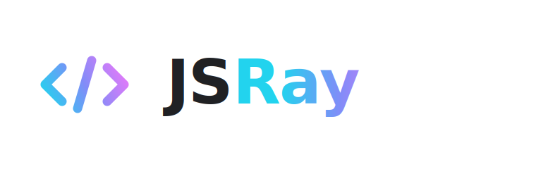

# JSRay Core

<p align="center">
  <picture>
    <source media="(prefers-color-scheme: dark)" srcset="assets/brand/jsray-logo-dark.svg">
    
  </picture>
</p>

[English](README.md) · **简体中文**

[](LICENSE)
[](CHANGELOG.md)
[](docs/versioning.md)
[](package.json)
[](dist/)
[](docs/languages.md)

> JavaScript 原生代码渲染内核 · 零依赖 · 23 类 token 语义体系

<sub>公开测试版 · 仅代表 Core 渲染框架 · 平台插件是独立仓库</sub>

---

## 项目边界

当前仓库是 **JSRay Core**，也就是独立的 JavaScript 原生代码渲染内核。平台插件是单独项目，应该放在独立 git 仓库中开发。

项目拆分与发布边界见 [docs/projects.md](docs/projects.md)。

## 生态愿景

JSRay 的目标是成为完整开源的代码渲染生态：一个轻量 Core 渲染器，多个官方集成与社区集成。

> 一个渲染核心，让代码在不同平台中发光。

WordPress、VS Code、终端等官方集成在独立仓库中开发,默认使用 JSRay Core,并保持完整可用,不以付费锁定基础能力。各集成仓库将在其到达 beta 时对外公开。平台层应开放 renderer adapter / hook，方便宿主项目在需要时接入其它渲染器。

---

## 特性

JSRay 把 6 个标识符族**视觉分离**，让你用余光就能区分参数、常量、内置变量、函数声明与调用：

| 类别 | Dark | Light | 直觉 |
|---|---|---|---|
| 普通变量 | `#E1E4E8` | `#1C1C1E` | 中性 |
| **函数参数** | `#F2B870` italic | `#B25E00` italic | 暖琥珀 · "输入流入" |
| **系统变量** (`this/self/console`) | `#7AB1FF` bold | `#0F68A0` bold | 冷蓝 · "运行时" |
| **常量** (`MAX_*`) | `#E2C792` | `#88611E` | 哑金 · "凝固" |
| **函数声明** | `#5DD8B0` bold | `#0F8568` bold | 亮薄荷 · "我定义" |
| **函数调用** | `#4FBD92` | `#1F7F66` | 中薄荷 · "我调用" |
| **内置函数** (`fetch/print`) | `#C9A6F2` | `#7A40C2` | 薰衣草 · "标准库" |
| **类型** (`User/str`) | `#5AC8FA` | `#0070C9` | 锐青 |
| **属性** (`.name`) | `#FFB1B1` | `#B23D6B` | 暖玫 · "归属" |

---

## 快速开始

```html
<!-- 1. 选一个主题（调色板）。后续会加更多主题，"default" 是签名风格。 -->
<link rel="stylesheet" href="dist/themes/default.css">
<!-- 2. 加载核心样式（结构 + token 绑定） -->
<link rel="stylesheet" href="dist/jsray.css">

<body data-theme="dark">
  <pre><code class="language-js">
    function fibonacci(n) { return n; }
  </code></pre>
</body>
<script src="dist/jsray.js"></script>
```

引入后会**自动扫描** `<code class="language-xxx">` 元素并染色。
明暗切换：把 `<body>` 的 `data-theme` 改为 `"light"` 或 `"dark"`。
没有语言 class 时，`JSRay.detectLanguage()` 可以自动识别常见片段——shebang 首行直接解析解释器,特征打分覆盖 PHP、Go、Swift、Kotlin、Dart、Lua、SQL、YAML、HTML、CSS、JavaScript、Python、Shell、Elixir、Scala、Objective-C、R、Perl、PowerShell、Haskell、GraphQL、TOML、Dockerfile、Makefile、diff 等。

### 主题

JSRay 把调色板独立成 `dist/themes/` 下的样式表。**始终加载一个主题 + `jsray.css`**。当前可用：

| 主题 | 文件 | 说明 |
|---|---|---|
| **default** | `dist/themes/default.css` | 签名调色板 · 含 dark / light 双模式 |
| **aurora** | `dist/themes/aurora.css` | 极光 · 极夜蓝底,极光薄荷 + 紫罗兰点缀 · 含 dark / light |
| **ember** | `dist/themes/ember.css` | 余烬 · 暖炭底,火焰关键字 + 铜绿薄荷函数 · 含 dark / light |
| **fjord** | `dist/themes/fjord.css` | 峡湾 · 北欧低饱和蓝灰,适合长时间阅读 · 含 dark / light |

每款主题都内置 dark + light 双模式(通过 `data-theme` 切换),覆盖全部 23 类 token,因此所有受支持的语言在任意主题下都能完整渲染。调色板源文件在 `themes/*.json`,由 `tools/generate-theme.mjs` 生成 CSS。切换主题时**只换 theme 的 `<link>`**,`jsray.css` 保持不动。

### 编程式 API

```js
// 高亮代码字符串
const html = JSRay.highlight('const x = 42;', 'js');

// 高亮单个元素
JSRay.highlightElement(document.querySelector('code'));

// 重新扫描整页
JSRay.highlightAll();

// 没有 class 时猜测语言
const lang = JSRay.detectLanguage('SELECT * FROM posts;');
```

---

## 支持的语言

| 语言 | class 标识 |
|---|---|
| JavaScript / TypeScript / JSX / TSX | `language-js` `language-ts` `language-jsx` `language-tsx` |
| Python | `language-python` `language-py` |
| PHP | `language-php` |
| Go | `language-go` |
| Swift / Kotlin / Dart / Lua | `language-swift` `language-kotlin` `language-kt` `language-dart` `language-lua` |
| Java | `language-java` |
| C / C++ / C# | `language-c` `language-cpp` `language-csharp` `language-cs` |
| Ruby | `language-ruby` `language-rb` |
| Rust | `language-rust` `language-rs` |
| HTML / XML / SVG / Vue | `language-html` `language-xml` `language-svg` `language-vue` |
| CSS / SCSS / SASS / LESS | `language-css` `language-scss` |
| JSON / JSONC | `language-json` |
| Shell / Bash / Zsh | `language-bash` `language-shell` |
| Markdown | `language-md` `language-markdown` |
| SQL | `language-sql` |
| YAML | `language-yaml` `language-yml` |
| Scala | `language-scala` `language-sc` |
| Objective-C | `language-objectivec` `language-objc` `language-objective-c` |
| R | `language-r` |
| Perl | `language-perl` `language-pl` |
| PowerShell | `language-powershell` `language-ps1` `language-pwsh` |
| Elixir | `language-elixir` `language-ex` `language-exs` |
| Haskell | `language-haskell` `language-hs` |
| GraphQL | `language-graphql` `language-gql` |
| TOML / INI | `language-toml` `language-ini` `language-properties` |
| Dockerfile | `language-dockerfile` `language-docker` |
| Makefile | `language-makefile` `language-make` |
| Diff / Patch | `language-diff` `language-patch` |

各语言的语法规则细节见 [docs/languages.md](docs/languages.md)。

---

## 项目结构

```
jsray/
├── src/                ← 开发源
│   ├── jsray.js
│   └── jsray.css
├── dist/               ← 发布产物 (零构建,目前 = src 副本)
│   ├── jsray.js
│   └── jsray.css
├── demo/
│   └── index.html      ← 示例语言可视化演示
├── docs/
│   ├── development.md  ← 全生态开发指南
│   ├── tokens.md       ← 23 token 语义详解
│   └── languages.md    ← 各语言规则范例
├── tokens.json         ← 调色板机器可读格式
├── build.sh            ← src → dist 同步
├── package.json
├── LICENSE
└── README.md
```

零依赖、零构建。`build.sh` 目前只做 `cp`，未来可叠加 minify。

---

## 设计理念

1. **语义优先于美学**。颜色服务于"工程师一眼看出这是什么"，不为审美而牺牲可辨识度。
2. **六族分离**。变量类不再扁平为一个白色，参数 / 系统 / 常量 / 局部变量在颜色与字重上各占一族。
3. **零依赖**。一个 `.js` 文件 + 一个 `.css` 文件就能跑，不绑定任何构建工具或框架。

详见 [docs/tokens.md](docs/tokens.md)。

---

## License

MIT — see [LICENSE](LICENSE).

---

由 **Eric Liu** 维护 · [JSRay.org](https://jsray.org)
